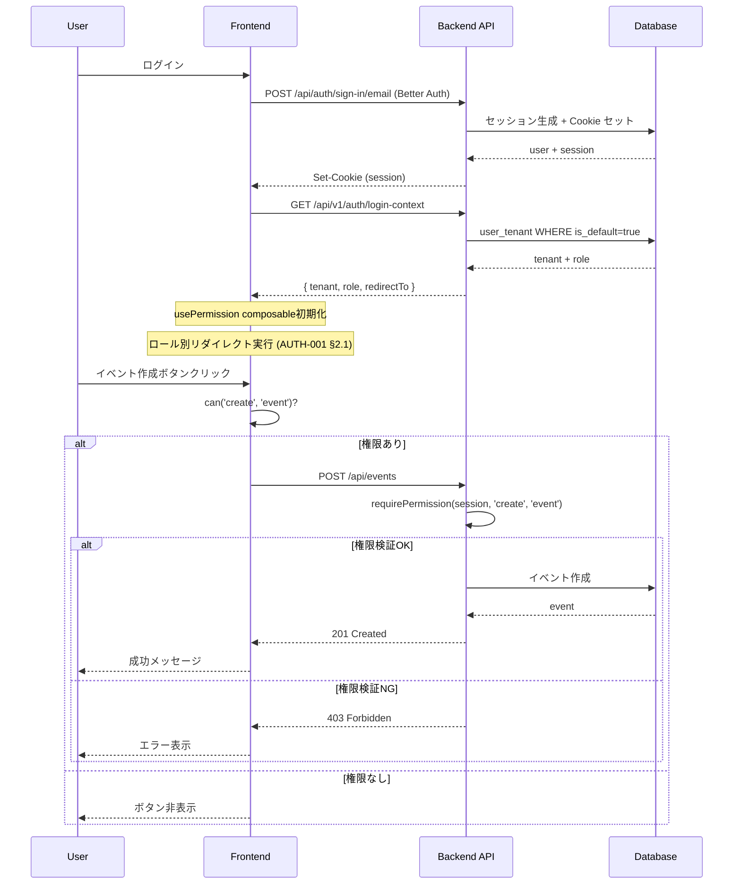

# ROLE-001〜004 権限・ロール管理 - 機能仕様書（SSOT）

> バージョン: 1.1
> ステータス: Draft
> 最終更新: 2026-02-09
> 関連: SSOT-4 §1.2, SSOT-5 §1.3

---

## §1 文書情報

### 1.1 機能ID・優先度

| 機能ID | 機能名 | 優先度 |
|--------|--------|--------|
| ROLE-001 | ロール定義（8ロール＋管理者） | P0 |
| ROLE-002 | ロールベースアクセス制御（RBAC） | P0 |
| ROLE-003 | 権限チェック（フロントエンド） | P0 |
| ROLE-004 | 権限チェック（バックエンド） | P0 |

### 1.2 概要

本仕様書は、Haishin+ HUBのRBAC（Role-Based Access Control）基盤を定義する統合SSOT文書である。

- **ROLE-001**: 9つのロール（system_admin + 8つのテナントロール）の定義
- **ROLE-002**: 権限マトリクスに基づくRBACメカニズム
- **ROLE-003**: フロントエンドでの権限チェック実装（composable）
- **ROLE-004**: バックエンドでの権限チェック実装（middleware）

### 1.3 ステークホルダー

- **Primary**: テナント管理者（tenant_admin）
- **Secondary**: 全ロールユーザー、システム管理者
- **Developer**: フロントエンド・バックエンド開発者

### 1.4 関連文書

- `docs/design/core/SSOT-4_DATA_MODEL.md` §1.2 ユーザー・組織管理
- `docs/design/core/SSOT-5_CROSS_CUTTING.md` §1.3 権限制御
- `docs/design/core/SSOT-3_API_CONTRACT.md` §2.2 テナント管理API
- `docs/design/features/common/AUTH-001_login.md` 認証基盤・ロール別リダイレクト
- `docs/design/features/common/ACCT-001_signup.md` 招待制サインアップ・ロール付与

---

## §2 機能概要 [CORE]

### 2.1 目的

セミナー・イベント運営に関わる全プレイヤーの役割を明確に定義し、テナント単位で適切なアクセス制御を実現する。各ロールに応じた機能制限とUIの出し分けにより、セキュリティとユーザビリティを両立する。

### 2.2 スコープ

#### In Scope

- 9ロールの定義と権限マトリクス
- テナント単位のロール管理
- フロントエンド権限チェック（composable）
- バックエンド権限チェック（middleware）
- ロール別UI制御（v-if, PermissionGate）
- API権限検証
- 複数テナントでの異なるロール保持

#### Out of Scope

- カスタムロールの作成（将来機能）
- 動的権限変更（運用フェーズで検討）
- 細粒度パーミッション（リソース単位の詳細権限）
- 監査ログ（別機能: AUDIT-001で対応）

### 2.3 ユーザーストーリー

#### Story 1: テナント管理者がメンバーにロールを付与

```
As a テナント管理者
I want メンバーにロールを付与できる
So that 適切な権限でシステムを利用できる
```

**受け入れ条件**:
- メンバー招待時にロールを選択できる
- 既存メンバーのロールを変更できる
- 自分自身のロールは変更できない（誤操作防止）

#### Story 2: ユーザーが複数テナントで異なるロールを保持

```
As a ユーザー
I want 複数テナントで異なるロールを持てる
So that 1つのアカウントで複数の組織に参加できる
```

**受け入れ条件**:
- 同一ユーザーが tenant_A で organizer、tenant_B で speaker として動作可能
- テナント切り替え時に権限が正しく切り替わる
- 各テナントで独立したロール管理

#### Story 3: 開発者が権限チェックを簡単に実装

```
As a 開発者
I want 権限チェックを宣言的に実装できる
So that セキュアで保守性の高いコードを書ける
```

**受け入れ条件**:
- `can('create', 'event')` で権限チェック可能
- `v-if="can('edit', 'venue')"` でUI制御可能
- バックエンドで自動的に権限検証される

### 2.4 ユーザーフロー



---

## §3 機能要件 [CORE]

### FR-001: 9ロール定義 (MUST) [CORE]

システムは以下の9ロールを定義する。

| ロール | 値 | 説明 | スコープ |
|--------|-----|------|---------|
| システム管理者 | `system_admin` | 全テナント管理権限 | グローバル |
| テナント管理者 | `tenant_admin` | テナント内全機能管理 | テナント |
| 主催者 | `organizer` | イベント企画・運営 | テナント |
| 会場担当 | `venue_staff` | 会場情報管理 | テナント |
| 配信事業者 | `streaming_provider` | 配信設定・管理 | テナント |
| 企画代行 | `event_planner` | イベント企画支援 | テナント |
| 登壇者 | `speaker` | 登壇情報管理 | テナント |
| 営業マーケ | `sales_marketing` | 営業・マーケ活動 | テナント |
| 参加者 | `participant` | イベント参加（イベント単位自動付与） | イベント |

**実装場所**: `server/database/schema/user-tenant.ts`

```typescript
export const roleEnum = pgEnum('user_role', [
  'system_admin',
  'tenant_admin',
  'organizer',
  'venue_staff',
  'streaming_provider',
  'event_planner',
  'speaker',
  'sales_marketing',
  'participant',
  'vendor',
]);
```

### FR-002: RBAC権限マトリクス (MUST) [CONTRACT]

権限は「アクション × リソース」のマトリクスで管理する。

#### アクション定義

| アクション | 説明 |
|-----------|------|
| `create` | リソース作成 |
| `read` | リソース閲覧 |
| `update` | リソース更新 |
| `delete` | リソース削除 |
| `invite` | メンバー招待 |
| `manage` | 完全管理権限 |

#### リソース定義

| リソース | 説明 |
|---------|------|
| `tenant` | テナント設定 |
| `member` | メンバー管理 |
| `event` | イベント |
| `venue` | 会場情報 |
| `streaming` | 配信設定 |
| `task` | タスク |
| `participant` | 参加者情報 |
| `ai_chat` | AI会話履歴 |

#### 権限マトリクス

| Role | tenant | member | event | venue | streaming | task | participant | ai_chat |
|------|--------|--------|-------|-------|-----------|------|-------------|---------|
| system_admin | manage | manage | manage | manage | manage | manage | manage | manage |
| tenant_admin | manage | manage | manage | manage | manage | manage | manage | manage |
| organizer | read | read | create/read/update/delete | create/read/update | create/read/update | create/read/update/delete | read | read |
| venue_staff | - | - | read | create/read/update/delete | - | read | - | read |
| streaming_provider | - | - | read | - | create/read/update/delete | read | - | read |
| event_planner | - | - | create/read/update | read | read | create/read/update | read | read |
| speaker | - | - | read | - | - | read | - | read |
| sales_marketing | - | - | read | - | - | read | read | read |
| participant | - | - | read | - | - | - | read (自分のみ) | read (自分のみ) |

### FR-003: フロントエンド権限チェック (MUST) [DETAIL]

`composables/usePermission.ts` を提供し、宣言的な権限チェックを実現する。

#### 機能要件

- `can(action, resource)` 関数で権限チェック
- `hasRole(...roles)` 関数でロールチェック
- リアクティブな権限状態
- テナント切り替え時の自動更新

#### 使用例

```vue
<script setup lang="ts">
const { can, hasRole } = usePermission()
</script>

<template>
  <button v-if="can('create', 'event')">
    イベント作成
  </button>

  <div v-if="hasRole('tenant_admin', 'organizer')">
    管理機能
  </div>
</template>
```

### FR-004: バックエンド権限チェック (MUST) [DETAIL]

`server/middleware/auth.ts` でAPI呼び出し時に自動検証する。

#### 機能要件

- セッションから role を取得
- 権限マトリクスと照合
- 権限不足時に 403 Forbidden 返却
- リソースオーナーシップチェック（自分のデータか）

#### 使用例

```typescript
// server/api/events/index.post.ts
export default defineEventHandler(async (event) => {
  await requirePermission(event, 'create', 'event')

  // 権限OKの場合のみここに到達
  const body = await readBody(event)
  // ... イベント作成処理
})
```

### FR-005: ロール別UIコンポーネント制御 (MUST) [DETAIL]

ロールに応じてUIを動的に制御する。

#### 実装パターン

```vue
<!-- パターン1: v-if による条件分岐 -->
<button v-if="can('delete', 'event')" @click="deleteEvent">
  削除
</button>

<!-- パターン2: PermissionGate コンポーネント -->
<PermissionGate :action="'update'" :resource="'venue'">
  <VenueEditForm />
</PermissionGate>

<!-- パターン3: ロール別コンポーネント -->
<DashboardView v-if="hasRole('tenant_admin')" />
<OrganizerView v-else-if="hasRole('organizer')" />
<ParticipantView v-else />
```

### FR-006: API権限検証 (MUST) [CONTRACT]

全てのAPI エンドポイントで権限検証を実施する。

#### 検証レイヤー

1. **認証チェック**: セッション有効性確認
2. **ロールチェック**: 必要ロール保持確認
3. **権限チェック**: アクション・リソース権限確認
4. **オーナーシップチェック**: リソース所有権確認（必要に応じて）

#### 実装例

```typescript
// server/utils/permission.ts
export async function requirePermission(
  event: H3Event,
  action: Action,
  resource: Resource,
  resourceOwnerId?: string
) {
  const session = await getSession(event)
  if (!session) throw createError({ statusCode: 401 })

  const permission = getPermission(session.role, action, resource)
  if (!permission) throw createError({
    statusCode: 403,
    message: `権限がありません: ${action} on ${resource}`
  })

  // オーナーシップチェック（必要に応じて）
  if (resourceOwnerId && session.userId !== resourceOwnerId) {
    throw createError({
      statusCode: 403,
      message: 'このリソースへのアクセス権限がありません'
    })
  }
}
```

### FR-007: テナント単位ロール管理 (MUST) [CORE]

ロールは **テナント単位** で管理する。

#### ビジネスルール

- ユーザーは各テナントで1つのロールを持つ
- `user_tenant` テーブルで管理
- テナント切り替え時にロールも切り替わる
- `system_admin` のみテナント横断権限

### FR-008: 複数テナント別ロール (SHOULD) [DETAIL]

1ユーザーが複数テナントで異なるロールを保持できる。

#### 実装例

```typescript
// ユーザーが保持するロール例
{
  userId: 'user_123',
  tenants: [
    { tenantId: 'tenant_A', role: 'organizer' },
    { tenantId: 'tenant_B', role: 'speaker' },
    { tenantId: 'tenant_C', role: 'tenant_admin' },
  ]
}
```

---

### §3-E エッジケース

| ケースID | 状況 | 期待動作 |
|---------|------|---------|
| EDGE-001 | ロールが未割り当て | デフォルトで `participant` 扱い、または招待待ち状態 |
| EDGE-002 | tenant_admin が自分のロールを変更しようとする | エラー: 「自分自身のロールは変更できません」 |
| EDGE-003 | 最後の tenant_admin が削除されようとする | エラー: 「最低1名の管理者が必要です」 |
| EDGE-004 | system_admin が他テナントのリソースにアクセス | 許可（全テナント管理権限） |
| EDGE-005 | イベント単位の participant がテナント機能にアクセス | 拒否: 403 Forbidden |
| EDGE-006 | ロール変更中にAPIリクエスト | 古いロールで検証 → セッション更新後に新ロール適用 |

---

### §3-F バリデーションルール

| ID | 項目 | ルール |
|----|------|--------|
| VAL-001 | ロール値 | enum値のみ許可 |
| VAL-002 | ロール変更権限 | tenant_admin または system_admin のみ |
| VAL-003 | 自己ロール変更 | 禁止 |
| VAL-004 | 最低管理者数 | テナント内 tenant_admin 最低1名 |
| VAL-005 | participant 付与 | イベント参加時のみ自動付与 |

---

### §3-G 外部連携

| 連携先 | 目的 | 備考 |
|--------|------|------|
| Better Auth Organization Plugin | テナント・メンバー管理 | ロール情報を `user_tenant.role` に格納 |
| - | - | - |

---

### §3-H 制約事項

| ID | 制約内容 | 理由 |
|----|---------|------|
| CONST-001 | カスタムロールは未対応 | MVP範囲外、将来機能 |
| CONST-002 | ロール階層構造なし | シンプルなフラットモデルで十分 |
| CONST-003 | 細粒度パーミッションなし | リソース単位の詳細権限は将来検討 |
| CONST-004 | 動的権限変更なし | 運用フェーズで検討 |

---

## §4 データ仕様 [CONTRACT]

### 4.1 テーブル定義: user_tenant

```typescript
// server/database/schema/user-tenant.ts
import { pgTable, text, timestamp, primaryKey } from 'drizzle-orm/pg-core'
import { users } from './auth'
import { tenants } from './tenant'

export const roleEnum = pgEnum('user_role', [
  'system_admin',
  'tenant_admin',
  'organizer',
  'venue_staff',
  'streaming_provider',
  'event_planner',
  'speaker',
  'sales_marketing',
  'participant',
  'vendor',
])

export const userTenant = pgTable('user_tenant', {
  userId: text('user_id').notNull().references(() => users.id, { onDelete: 'cascade' }),
  tenantId: text('tenant_id').notNull().references(() => tenants.id, { onDelete: 'cascade' }),
  role: roleEnum('role').notNull().default('participant'),
  joinedAt: timestamp('joined_at').notNull().defaultNow(),
  invitedBy: text('invited_by').references(() => users.id),
}, (table) => ({
  pk: primaryKey({ columns: [table.userId, table.tenantId] }),
}))
```

### 4.2 権限マトリクスデータ

```typescript
// server/utils/permission-matrix.ts
export type Action = 'create' | 'read' | 'update' | 'delete' | 'invite' | 'manage'
export type Resource = 'tenant' | 'member' | 'event' | 'venue' | 'streaming' | 'task' | 'participant' | 'ai_chat'
export type Role = 'system_admin' | 'tenant_admin' | 'organizer' | 'venue_staff' | 'streaming_provider' | 'event_planner' | 'speaker' | 'sales_marketing' | 'participant' | 'vendor'

export const PERMISSION_MATRIX: Record<Role, Record<Resource, Action[]>> = {
  system_admin: {
    tenant: ['manage'],
    member: ['manage'],
    event: ['manage'],
    venue: ['manage'],
    streaming: ['manage'],
    task: ['manage'],
    participant: ['manage'],
    ai_chat: ['manage'],
  },
  tenant_admin: {
    tenant: ['manage'],
    member: ['manage'],
    event: ['manage'],
    venue: ['manage'],
    streaming: ['manage'],
    task: ['manage'],
    participant: ['manage'],
    ai_chat: ['manage'],
  },
  organizer: {
    tenant: ['read'],
    member: ['read'],
    event: ['create', 'read', 'update', 'delete'],
    venue: ['create', 'read', 'update'],
    streaming: ['create', 'read', 'update'],
    task: ['create', 'read', 'update', 'delete'],
    participant: ['read'],
    ai_chat: ['read'],
  },
  venue_staff: {
    tenant: [],
    member: [],
    event: ['read'],
    venue: ['create', 'read', 'update', 'delete'],
    streaming: [],
    task: ['read'],
    participant: [],
    ai_chat: ['read'],
  },
  streaming_provider: {
    tenant: [],
    member: [],
    event: ['read'],
    venue: [],
    streaming: ['create', 'read', 'update', 'delete'],
    task: ['read'],
    participant: [],
    ai_chat: ['read'],
  },
  event_planner: {
    tenant: [],
    member: [],
    event: ['create', 'read', 'update'],
    venue: ['read'],
    streaming: ['read'],
    task: ['create', 'read', 'update'],
    participant: ['read'],
    ai_chat: ['read'],
  },
  speaker: {
    tenant: [],
    member: [],
    event: ['read'],
    venue: [],
    streaming: [],
    task: ['read'],
    participant: [],
    ai_chat: ['read'],
  },
  sales_marketing: {
    tenant: [],
    member: [],
    event: ['read'],
    venue: [],
    streaming: [],
    task: ['read'],
    participant: ['read'],
    ai_chat: ['read'],
  },
  participant: {
    tenant: [],
    member: [],
    event: ['read'],
    venue: [],
    streaming: [],
    task: [],
    participant: ['read'], // 自分のみ
    ai_chat: ['read'], // 自分のみ
  },
  vendor: {
    tenant: [],
    member: [],
    event: ['read'],
    venue: [],
    streaming: [],
    task: ['read'],
    participant: [],
    ai_chat: ['read'],
  },
}

export function hasPermission(role: Role, action: Action, resource: Resource): boolean {
  const permissions = PERMISSION_MATRIX[role][resource]
  return permissions.includes('manage') || permissions.includes(action)
}
```

---

## §5 API仕様 [CONTRACT]

### 5.1 概要

RBAC機能には **専用のAPIエンドポイントは存在しない**。

- ロール管理は **テナントメンバー管理API** で実施
- 権限チェックは **各APIエンドポイントで自動実行**

参照: `docs/design/core/SSOT-3_API_CONTRACT.md` §2.2 テナント管理

### 5.2 関連エンドポイント

#### POST /api/tenants/:tenantId/members (メンバー招待)

> **ACCT-001 連携**: 招待受諾時に `user_tenant` レコードが自動作成される。
> 招待で指定した `role` が `user_tenant.role` にセットされる。
> 参照: `ACCT-001_signup.md` §7 招待フロー

```typescript
// リクエスト
{
  "email": "user@example.com",
  "role": "organizer"
}

// レスポンス
{
  "id": "invite_abc123",
  "email": "user@example.com",
  "role": "organizer",
  "status": "pending",
  "expiresAt": "2026-02-16T00:00:00Z"
}
```

#### PATCH /api/tenants/:tenantId/members/:userId (ロール変更)

```typescript
// リクエスト
{
  "role": "tenant_admin"
}

// レスポンス
{
  "userId": "user_123",
  "tenantId": "tenant_abc",
  "role": "tenant_admin",
  "updatedAt": "2026-02-09T10:00:00Z"
}
```

### 5.3 権限チェックエンドポイント（補助的）

#### GET /api/permissions/check

```typescript
// クエリパラメータ
?action=create&resource=event

// レスポンス
{
  "allowed": true,
  "role": "organizer",
  "reason": null
}
```

**用途**: フロントエンドでの権限プリチェック（オプション）

---

## §6 UI仕様 [CONTRACT/DETAIL]

### 6.1 概要

RBAC機能には **専用のUI画面は存在しない**。

- 権限チェックロジックのみ提供
- 各画面で `usePermission` composable を使用
- ロール管理UIは「メンバー管理画面」で実施

### 6.2 usePermission Composable [DETAIL]

```typescript
// composables/usePermission.ts
import type { Action, Resource, Role } from '~/server/utils/permission-matrix'

export function usePermission() {
  const { data: session } = useAuth()

  const currentRole = computed<Role | null>(() => {
    return session.value?.user?.role ?? null
  })

  /**
   * 権限チェック
   * @param action - アクション (create, read, update, delete, invite, manage)
   * @param resource - リソース (event, venue, task, etc.)
   * @returns 権限があれば true
   */
  const can = (action: Action, resource: Resource): boolean => {
    if (!currentRole.value) return false
    return hasPermission(currentRole.value, action, resource)
  }

  /**
   * ロールチェック
   * @param roles - チェックするロール（複数可）
   * @returns いずれかのロールを持っていれば true
   */
  const hasRole = (...roles: Role[]): boolean => {
    if (!currentRole.value) return false
    return roles.includes(currentRole.value)
  }

  /**
   * 管理者チェック
   */
  const isAdmin = computed(() => {
    return hasRole('system_admin', 'tenant_admin')
  })

  return {
    can,
    hasRole,
    isAdmin,
    currentRole,
  }
}
```

### 6.3 PermissionGate コンポーネント [DETAIL]

```vue
<!-- components/common/PermissionGate.vue -->
<script setup lang="ts">
import type { Action, Resource } from '~/server/utils/permission-matrix'

interface Props {
  action: Action
  resource: Resource
  fallback?: boolean // true の場合、権限なしでもスロット内容を表示（無効化状態で）
}

const props = defineProps<Props>()
const { can } = usePermission()

const hasPermission = computed(() => can(props.action, props.resource))
</script>

<template>
  <div v-if="hasPermission">
    <slot />
  </div>
  <div v-else-if="fallback" class="opacity-50 pointer-events-none">
    <slot />
  </div>
</template>
```

### 6.4 使用例

```vue
<script setup lang="ts">
const { can, hasRole, isAdmin } = usePermission()
</script>

<template>
  <!-- パターン1: v-if で条件分岐 -->
  <UButton
    v-if="can('create', 'event')"
    @click="createEvent"
  >
    イベント作成
  </UButton>

  <!-- パターン2: PermissionGate コンポーネント -->
  <PermissionGate action="update" resource="venue">
    <VenueEditForm />
  </PermissionGate>

  <!-- パターン3: fallback で無効化表示 -->
  <PermissionGate action="delete" resource="event" :fallback="true">
    <UButton color="red" disabled>
      削除（権限なし）
    </UButton>
  </PermissionGate>

  <!-- パターン4: ロール別コンポーネント -->
  <DashboardAdmin v-if="isAdmin" />
  <DashboardOrganizer v-else-if="hasRole('organizer')" />
  <DashboardParticipant v-else />
</template>
```

---

## §7 ビジネスルール [CORE]

### BR-001: system_admin の全テナントアクセス権 [CORE]

`system_admin` は全テナントのリソースに対して `manage` 権限を持つ。

**実装**:
```typescript
if (session.role === 'system_admin') {
  return true // 全権限許可
}
```

### BR-002: tenant_admin のテナント内完全管理権 [CORE]

`tenant_admin` は自テナント内の全リソースに対して `manage` 権限を持つ。

**制約**:
- 他テナントのリソースにはアクセス不可
- 自分自身のロールは変更不可

### BR-003: ロールはテナントスコープ [CORE]

ロールは **テナント単位** で管理される。

**例**:
```typescript
{
  userId: 'user_123',
  tenantId: 'tenant_A',
  role: 'organizer'
}
```

同一ユーザーが別テナントで異なるロールを持つ:
```typescript
[
  { userId: 'user_123', tenantId: 'tenant_A', role: 'organizer' },
  { userId: 'user_123', tenantId: 'tenant_B', role: 'speaker' },
]
```

### BR-004: ロール別リダイレクト先の決定 [CORE]

ログイン成功後、`login-context` API がユーザーのロールに基づいてリダイレクト先を返却する。

> **AUTH-001 連携**: `types/auth.ts` の `ROLE_REDIRECT_MAP` で一元管理。
> 参照: `AUTH-001_login.md` §2.1 ロール別リダイレクト先テーブル

| ロール | リダイレクト先 |
|--------|-------------|
| `system_admin` | `/app/admin` |
| `tenant_admin` / `organizer` / `venue_staff` / `streaming_provider` / `event_planner` / `sales_marketing` | `/app` |
| `speaker` / `participant` / `vendor` | `/app/events` |

### BR-005: 招待フローでのロール付与 [CORE]

メンバー招待時に指定されたロールが、招待受諾時に `user_tenant.role` として自動付与される。

> **ACCT-001 連携**: 招待受諾 API (`POST /api/v1/invitations/:token/accept`) が
> `user` + `user_tenant`（招待時指定 role + is_default=true）を同時作成する。

**ルール**:
- 招待者は `tenant_admin` 以上の権限が必要
- `system_admin` ロールは招待で付与不可（DB直接操作のみ）
- セルフ登録ユーザーはテナント未所属（`user_tenant` レコードなし）

### BR-006: participant の自動付与 [CORE]

> 旧 BR-004

`participant` ロールは **イベント参加時に自動付与** される。

**実装**:
- イベント申し込み完了時に `event_member` テーブルに登録
- テナントメンバーとしては登録されない（イベント限定）

### BR-007: 権限継承ルール [DETAIL]

> 旧 BR-005

権限マトリクスに `manage` が設定されている場合、全アクション（create, read, update, delete）が許可される。

**実装**:
```typescript
export function hasPermission(role: Role, action: Action, resource: Resource): boolean {
  const permissions = PERMISSION_MATRIX[role][resource]
  return permissions.includes('manage') || permissions.includes(action)
}
```

### BR-008: 最低管理者数の維持 [DETAIL]

> 旧 BR-006

テナントには最低1名の `tenant_admin` が必要。

**実装**:
```typescript
// 削除・ロール変更時にチェック
const adminCount = await db
  .select()
  .from(userTenant)
  .where(and(
    eq(userTenant.tenantId, tenantId),
    eq(userTenant.role, 'tenant_admin')
  ))

if (adminCount.length <= 1) {
  throw createError({
    statusCode: 400,
    message: '最低1名の管理者が必要です'
  })
}
```

### BR-009: 自己ロール変更の禁止 [DETAIL]

> 旧 BR-007

ユーザーは自分自身のロールを変更できない。

**実装**:
```typescript
if (session.userId === targetUserId) {
  throw createError({
    statusCode: 400,
    message: '自分自身のロールは変更できません'
  })
}
```

---

## §8 非機能要件 [DETAIL]

### 8.1 パフォーマンス

| 項目 | 目標値 | 測定方法 |
|------|--------|----------|
| 権限チェック処理時間 | < 10ms | サーバーログ |
| セッション取得時間 | < 50ms | Better Auth計測 |
| 権限マトリクス参照 | メモリキャッシュ | 定数オブジェクト |

### 8.2 セキュリティ

| 項目 | 要件 | 実装方法 |
|------|------|----------|
| セッション検証 | 全APIで必須 | Better Auth middleware |
| ロール検証 | 全APIで必須 | `requirePermission()` |
| オーナーシップ検証 | リソース操作時 | userId比較 |
| 権限昇格防止 | ロール変更時チェック | 管理者権限確認 |

### 8.3 保守性

| 項目 | 要件 |
|------|------|
| 権限マトリクス | 定数ファイルで一元管理 |
| ロール追加 | enum更新 + マトリクス追加のみ |
| 権限変更 | マトリクス更新のみ（コード変更不要） |

---

## §9 エラーハンドリング [DETAIL]

### 9.1 エラー定義

| エラーコード | HTTP Status | メッセージ | 原因 |
|-------------|-------------|-----------|------|
| AUTH_REQUIRED | 401 | 認証が必要です | セッションなし |
| FORBIDDEN | 403 | 権限がありません | ロール・権限不足 |
| ROLE_INVALID | 400 | 無効なロールです | 不正なロール値 |
| SELF_ROLE_CHANGE | 400 | 自分自身のロールは変更できません | 自己変更試行 |
| LAST_ADMIN | 400 | 最低1名の管理者が必要です | 最後の管理者削除試行 |
| RESOURCE_NOT_FOUND | 404 | リソースが見つかりません | 存在しないリソース |
| OWNER_MISMATCH | 403 | このリソースへのアクセス権限がありません | オーナー不一致 |

### 9.2 エラーレスポンス形式

```typescript
{
  "error": {
    "code": "FORBIDDEN",
    "message": "権限がありません: create on event",
    "details": {
      "action": "create",
      "resource": "event",
      "role": "participant"
    }
  }
}
```

### 9.3 実装例

```typescript
// server/utils/permission.ts
export class PermissionError extends Error {
  constructor(
    public action: Action,
    public resource: Resource,
    public role: Role,
    message?: string
  ) {
    super(message || `権限がありません: ${action} on ${resource}`)
    this.name = 'PermissionError'
  }
}

export async function requirePermission(
  event: H3Event,
  action: Action,
  resource: Resource
) {
  const session = await getSession(event)
  if (!session) {
    throw createError({
      statusCode: 401,
      statusMessage: 'AUTH_REQUIRED',
      message: '認証が必要です'
    })
  }

  const allowed = hasPermission(session.role, action, resource)
  if (!allowed) {
    throw createError({
      statusCode: 403,
      statusMessage: 'FORBIDDEN',
      message: `権限がありません: ${action} on ${resource}`,
      data: {
        action,
        resource,
        role: session.role
      }
    })
  }
}
```

---

## §10 テストケース

### 10.1 ユニットテスト: 権限マトリクス

```typescript
// tests/unit/permission-matrix.test.ts
import { describe, it, expect } from 'vitest'
import { hasPermission } from '~/server/utils/permission-matrix'

describe('権限マトリクス', () => {
  it('system_admin は全リソースに manage 権限', () => {
    expect(hasPermission('system_admin', 'create', 'event')).toBe(true)
    expect(hasPermission('system_admin', 'delete', 'tenant')).toBe(true)
  })

  it('organizer はイベント作成可能', () => {
    expect(hasPermission('organizer', 'create', 'event')).toBe(true)
  })

  it('participant はイベント閲覧のみ', () => {
    expect(hasPermission('participant', 'read', 'event')).toBe(true)
    expect(hasPermission('participant', 'create', 'event')).toBe(false)
  })

  it('speaker はテナント管理不可', () => {
    expect(hasPermission('speaker', 'manage', 'tenant')).toBe(false)
  })
})
```

### 10.2 統合テスト: API権限チェック

```typescript
// tests/integration/api/events.test.ts
import { describe, it, expect } from 'vitest'
import { createTestUser, createTestSession } from '~/tests/factories/auth'

describe('POST /api/events', () => {
  it('[成功] organizer はイベント作成可能', async () => {
    const user = await createTestUser({ role: 'organizer' })
    const session = await createTestSession(user)

    const response = await $fetch('/api/events', {
      method: 'POST',
      headers: { Cookie: `session=${session.token}` },
      body: { title: 'テストイベント' }
    })

    expect(response.statusCode).toBe(201)
  })

  it('[失敗] participant はイベント作成不可', async () => {
    const user = await createTestUser({ role: 'participant' })
    const session = await createTestSession(user)

    await expect(
      $fetch('/api/events', {
        method: 'POST',
        headers: { Cookie: `session=${session.token}` },
        body: { title: 'テストイベント' }
      })
    ).rejects.toMatchObject({
      statusCode: 403,
      statusMessage: 'FORBIDDEN'
    })
  })
})
```

### 10.3 E2Eテスト: UI権限制御

```typescript
// tests/e2e/permission-ui.spec.ts
import { test, expect } from '@playwright/test'

test.describe('権限によるUI制御', () => {
  test('[organizer] イベント作成ボタンが表示される', async ({ page }) => {
    await page.goto('/login')
    await page.fill('[name="email"]', 'organizer@example.com')
    await page.fill('[name="password"]', 'password')
    await page.click('button[type="submit"]')

    await page.goto('/events')
    await expect(page.locator('button:has-text("イベント作成")')).toBeVisible()
  })

  test('[participant] イベント作成ボタンが非表示', async ({ page }) => {
    await page.goto('/login')
    await page.fill('[name="email"]', 'participant@example.com')
    await page.fill('[name="password"]', 'password')
    await page.click('button[type="submit"]')

    await page.goto('/events')
    await expect(page.locator('button:has-text("イベント作成")')).not.toBeVisible()
  })
})
```

### 10.4 テストケースマトリクス

| テストID | テスト内容 | 対象 | 期待結果 | 優先度 |
|---------|----------|------|---------|--------|
| ROLE-TC-001 | system_admin全権限 | ユニット | PASS | P0 |
| ROLE-TC-002 | tenant_admin管理権限 | ユニット | PASS | P0 |
| ROLE-TC-003 | organizer イベント作成 | API | 201 Created | P0 |
| ROLE-TC-004 | participant イベント作成 | API | 403 Forbidden | P0 |
| ROLE-TC-005 | 自己ロール変更 | API | 400 Bad Request | P1 |
| ROLE-TC-006 | 最後のadmin削除 | API | 400 Bad Request | P1 |
| ROLE-TC-007 | UI権限制御（ボタン表示） | E2E | ボタン表示 | P0 |
| ROLE-TC-008 | UI権限制御（ボタン非表示） | E2E | ボタン非表示 | P0 |
| ROLE-TC-009 | 複数テナント別ロール | 統合 | 正しく切替 | P1 |

---

## §11 依存関係

### 11.1 依存する機能

| 機能ID | 機能名 | 依存内容 |
|--------|--------|---------|
| AUTH-001 | ログイン | セッション管理・ロール取得 |
| AUTH-002 | アカウント登録 | 初期ロール設定 |
| TENANT-001 | テナント管理 | テナント単位ロール管理 |
| TENANT-002 | メンバー管理 | ロール付与・変更 |

### 11.2 この機能に依存する機能

| 機能ID | 機能名 | 依存内容 |
|--------|--------|---------|
| EVENT-001 | イベント管理 | イベント作成・編集権限 |
| VENUE-001 | 会場管理 | 会場情報編集権限 |
| TASK-001 | タスク管理 | タスク作成・割当権限 |
| AI-001 | AIアシスタント | 会話履歴アクセス権限 |
| 全API | - | 全エンドポイントで権限チェック |

### 11.3 技術依存

| 技術 | 用途 | バージョン |
|------|------|-----------|
| Better Auth | セッション・テナント管理 | 0.20.0+ |
| Drizzle ORM | DB操作 | 0.36.0+ |
| PostgreSQL | データ永続化 | 16+ |

---

## §12 未決定事項

| ID | 項目 | 内容 | 期限 | 担当 |
|----|------|------|------|------|
| OPEN-001 | カスタムロール | 将来的にカスタムロールを作成可能にするか | Phase 2検討 | PdM |
| OPEN-002 | 細粒度パーミッション | リソース単位の詳細権限（例: イベントID単位）を導入するか | Phase 2検討 | Tech Lead |
| OPEN-003 | 権限委譲 | テナント管理者が権限を一時的に委譲できる機能 | Phase 3検討 | PdM |
| OPEN-004 | 監査ログ | 権限変更・アクセス履歴のログ記録 | Phase 2検討 | Tech Lead |
| OPEN-005 | ロール階層 | ロール間の継承関係（例: admin > organizer） | Phase 3検討 | Tech Lead |

---

## 実装ガイダンス

### ステップ1: スキーマ定義

```bash
# マイグレーション作成
pnpm drizzle-kit generate:pg
pnpm drizzle-kit migrate
```

### ステップ2: 権限マトリクス実装

```typescript
// server/utils/permission-matrix.ts に実装済み
```

### ステップ3: バックエンド権限チェック

```typescript
// server/middleware/auth.ts
export default defineEventHandler(async (event) => {
  // セッション取得
  const session = await getSession(event)
  if (!session) return // public endpoint

  // セッションにロール情報を追加
  event.context.auth = {
    userId: session.userId,
    tenantId: session.tenantId,
    role: session.role
  }
})

// server/utils/permission.ts
export async function requirePermission(
  event: H3Event,
  action: Action,
  resource: Resource
) {
  const auth = event.context.auth
  if (!auth) throw createError({ statusCode: 401 })

  if (!hasPermission(auth.role, action, resource)) {
    throw createError({
      statusCode: 403,
      message: `権限がありません: ${action} on ${resource}`
    })
  }
}
```

### ステップ4: フロントエンド権限チェック

```typescript
// composables/usePermission.ts に実装済み
```

### ステップ5: コンポーネント実装

```vue
<!-- components/common/PermissionGate.vue に実装済み -->
```

### ステップ6: API実装例

```typescript
// server/api/events/index.post.ts
export default defineEventHandler(async (event) => {
  // 権限チェック
  await requirePermission(event, 'create', 'event')

  // ボディ取得
  const body = await readBody(event)

  // バリデーション
  const validated = createEventSchema.parse(body)

  // DB操作
  const newEvent = await db.insert(events).values({
    ...validated,
    tenantId: event.context.auth.tenantId,
    createdBy: event.context.auth.userId,
  }).returning()

  return newEvent[0]
})
```

### ステップ7: テスト実装

```typescript
// tests/ 配下に実装
```

---

## 改訂履歴

| バージョン | 日付 | 変更内容 | 担当 |
|-----------|------|---------|------|
| 1.0 | 2026-02-09 | 初版作成（ROLE-001〜004統合SSOT） | Claude |
| 1.1 | 2026-02-09 | AUTH-001/ACCT-001カスタマイズ影響反映: §2.4ユーザーフロー修正(Better Auth API+login-context), §5.2招待API連携追記, §7にBR-004(ロール別リダイレクト),BR-005(招待ロール付与)追加 | Claude |

---

**END OF DOCUMENT**
