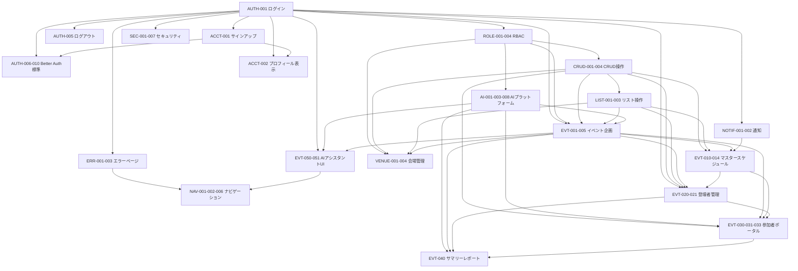

# 実装計画書 - Haishin+ HUB

> 14_IMPLEMENTATION_ORDER.md に基づき、SSOT 20ファイルの §1 + §11 を分析して決定

---

## 依存グラフ（Mermaid）

---

## 循環依存チェック

**結果: 循環依存なし** ✅

---

## Wave 分類（トポロジカルソート）

### Phase 1: 共通機能（土台）

#### Layer 0: インフラ・環境構築 ✅ 完了

| # | 内容 | ステータス |
|---|------|-----------|
| 1 | リポジトリ + ブランチ戦略 | ✅ 完了 |
| 2 | CI パイプライン | ✅ 完了 |
| 3 | DB マイグレーション基盤 | ✅ 完了 |
| 4 | Husky + commitlint | ✅ 完了 |

#### Layer 1: 認証基盤

| 順位 | 機能ID | 機能名 | P | 規模 | 被依存数 | ステータス |
|------|--------|--------|---|------|---------|-----------|
| 1 | AUTH-001 | ログイン | P0 | M | 11+ | ✅ 実装済み（監査指摘あり） |
| 2 | ACCT-001 | サインアップ | P0 | M | 3 | 未実装 |
| 3 | AUTH-005 | ログアウト | P0 | S | 0 | 未実装 |
| 4 | AUTH-006-010 | Better Auth標準 | P0 | S | 4 | 未実装 |

#### Layer 2: 共通基盤

| 順位 | 機能ID | 機能名 | P | 規模 | 被依存数 | ステータス |
|------|--------|--------|---|------|---------|-----------|
| 1 | ROLE-001-004 | RBAC | P0 | L | 5+ | 未実装 |
| 2 | SEC-001-007 | セキュリティ | P0 | M | 全API | 未実装 |
| 3 | ERR-001-003 | エラーページ | P0 | S | 全機能 | 未実装 |
| 4 | CRUD-001-004 | CRUD操作 | P0 | L | 6 | 未実装 |
| 5 | AI-001-003-008 | AIプラットフォーム | P0 | XL | 4 | 未実装 |

#### Layer 3: 共通UI

| 順位 | 機能ID | 機能名 | P | 規模 | 被依存数 | ステータス |
|------|--------|--------|---|------|---------|-----------|
| 1 | LIST-001-003 | リスト操作 | P0 | M | 4 | 未実装 |
| 2 | ACCT-002 | プロフィール表示 | P0 | S | 2 | 未実装 |
| 3 | NOTIF-001-002 | 通知 | P0 | M | 2 | 未実装 |

### Phase 2: 個別機能

#### Wave 1: 依存ゼロ（共通機能のみに依存）

| 順位 | 機能ID | 機能名 | P | 規模 | 被依存数 | 根拠 |
|------|--------|--------|---|------|---------|------|
| 1 | EVT-001-005 | イベント企画 | P0 | XL | 7 | 被依存最多、全イベント機能の基盤 |
| 2 | EVT-050-051 | AIアシスタントUI | P0 | L | 1 | AIコンシェルジュ（MVP必須） |
| 3 | VENUE-001-004 | 会場管理 | P0 | L | 2 | EVT-001と並行可能 |

#### Wave 2: Wave 1 に依存

| 順位 | 機能ID | 機能名 | P | 規模 | 被依存数 | 依存 |
|------|--------|--------|---|------|---------|------|
| 1 | EVT-010-014 | マスタースケジュール | P0 | L | 3 | EVT-001-005 |
| 2 | EVT-020-021 | 登壇者管理 | P0 | M | 3 | EVT-001-005 |

#### Wave 3: Wave 2 に依存

| 順位 | 機能ID | 機能名 | P | 規模 | 被依存数 | 依存 |
|------|--------|--------|---|------|---------|------|
| 1 | EVT-030-031-033 | 参加者ポータル | P0 | XL | 2 | EVT-001-005, EVT-010-014 |

#### Wave 4: Wave 3 に依存

| 順位 | 機能ID | 機能名 | P | 規模 | 被依存数 | 依存 |
|------|--------|--------|---|------|---------|------|
| 1 | EVT-040 | サマリーレポート | P1 | L | 0 | EVT-001-005, EVT-030-031-033, AI-001 |

#### ナビゲーション（EVT-050完了後）

| 順位 | 機能ID | 機能名 | P | 規模 | 被依存数 | 依存 |
|------|--------|--------|---|------|---------|------|
| 1 | NAV-001-002-006 | ナビゲーション | P0 | M | 2 | AUTH-001, EVT-050-051 |

---

## 縦スライス（Vertical Slice）

### Slice 1: 「初回利用者がサービスにログインできる」
- AUTH-001（ログイン）✅ 実装済み
- ACCT-001（サインアップ）
- AUTH-005（ログアウト）
- AUTH-006-010（Better Auth標準: パスワードリセット、メール認証）
- ROLE-001-004（RBAC基盤）
- ERR-001-003（エラーページ）
- SEC-001-007（セキュリティ基盤）

### Slice 2: 「組織管理者がイベントを作成・管理できる」
- CRUD-001-004（CRUD共通）
- LIST-001-003（リスト共通）
- EVT-001-005（イベント企画）
- VENUE-001-004（会場管理）
- NAV-001-002-006（ナビゲーション）

### Slice 3: 「イベントの詳細を管理し参加者に公開できる」
- EVT-010-014（マスタースケジュール）
- EVT-020-021（登壇者管理）
- EVT-030-031-033（参加者ポータル）
- NOTIF-001-002（通知）

### Slice 4: 「AIアシスタントに相談しながら運営できる」
- AI-001-003-008（AIプラットフォーム）
- EVT-050-051（AIアシスタントUI）
- EVT-040（サマリーレポート）
- ACCT-002（プロフィール表示）

---

## タスク分解ルール（14_IMPLEMENTATION_ORDER.md Part 2 準拠）

各機能は以下のサブタスクに分解:

| タスクID | レイヤー | SSOT参照 | 内容 |
|---------|---------|---------|------|
| {FEAT}-DB | データ | §4 データ仕様 | スキーマ・マイグレーション |
| {FEAT}-API | API | §5 API仕様 | エンドポイント実装 |
| {FEAT}-UI | UI | §6 UI仕様 | コンポーネント・ページ |
| {FEAT}-INT | 統合 | §7 ビジネスルール | ビジネスロジック統合 |
| {FEAT}-TEST | テスト | §10 テストケース | ユニット・統合・E2Eテスト |
| {FEAT}-REVIEW | レビュー | 全セクション | コードレビュー・SSOT準拠確認 |

---

## 推定タイムライン

| Phase | 期間 | 内容 |
|-------|------|------|
| Layer 0 | ✅ 完了 | インフラ・環境構築 |
| Layer 1 | 1週間 | 認証基盤（ACCT-001, AUTH-005, AUTH-006-010） |
| Layer 2 | 2週間 | 共通基盤（ROLE, SEC, ERR, CRUD, AI基盤） |
| Layer 3 | 1週間 | 共通UI（LIST, ACCT-002, NOTIF） |
| Wave 1 | 2週間 | EVT-001-005, EVT-050-051, VENUE |
| Wave 2 | 1週間 | EVT-010-014, EVT-020-021 |
| Wave 3 | 2週間 | EVT-030-031-033 |
| Wave 4 | 1週間 | EVT-040, NAV |
| **合計** | **約10週間** | |

---

## 作成日

2026-02-10
